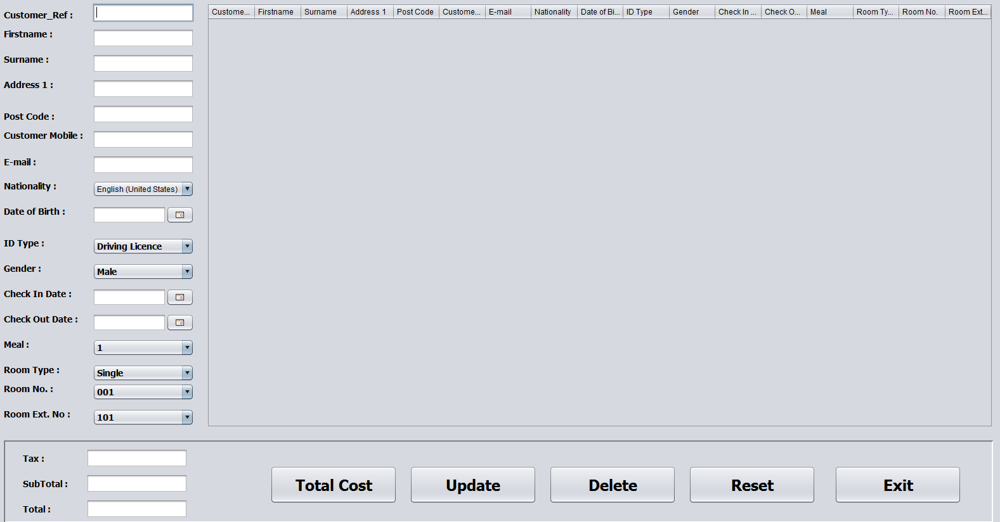

# Hotel Management System

The aim of this project to manage hotel system by:

- fill the information of the customer.

- then, save the information into the table and calculate costs.

- the Delete button can delete any row of the table.

- the Reset button delete all rows of the table.

- the Exit button can exit the program.

